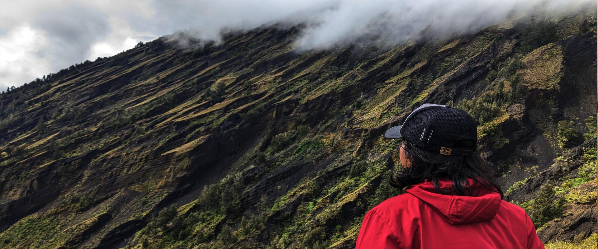

## Hi Saya Muhammad Suyuti 👋

###
<h2 align="left">Tentang saya</h2>

###

✨ Masih belajar ngoding...  📚 Pengalaman bekerja di perusahaan manufaktur alas kaki... 🎯 Pengen sukses... 

###
<h2 align="left">Code</h2>

###
<!--<!--

  
  
  
  
  
  
  
  
  
  
  
  
  
  
  

-->

###
<picture>
  <source media="(prefers-color-scheme: dark)" srcset="https://raw.githubusercontent.com/Suyuti29/Suyuti29/output/pacman-contribution-graph-dark.svg">
  <source media="(prefers-color-scheme: light)" srcset="https://raw.githubusercontent.com/Suyuti29/Suyuti29/output/pacman-contribution-graph.svg">
  
</picture>

